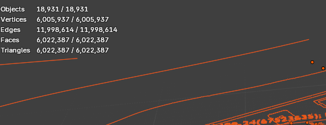
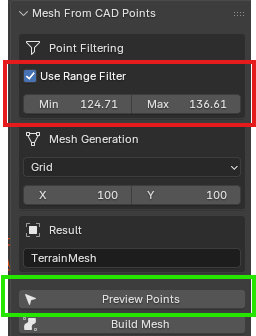
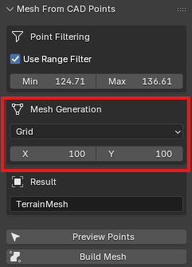
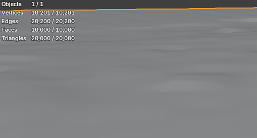

# Mesh From CAD Points

Generate terrain meshes directly from CAD elevation text points inside Blender.

This addon reads elevation values from FONT objects and creates a terrain surface automatically using Delaunay triangulation or Grid generation methods.

---

# Download

Download the latest addon ZIP file from the repository files.

---

# Features

* Delaunay triangulation (TIN)
* Grid terrain generation
* Height range filtering
* Point preview selection
* Fast CAD-to-terrain workflow
* Simple Blender integration

---

# Workflow

## 1. Import CAD points

Import elevation text points from CAD software into Blender.

---

## 2. Set elevation range

Choose minimum and maximum elevation values for filtering terrain points.

Red = minimum / maximum terrain height
Green = selected valid points

---

## 3. Choose mesh generation method

### Delaunay (TIN)

Accurate triangulation using original CAD points.

### Grid

Smoothed terrain generation with cleaner polygon flow.

---

## 4. Build terrain mesh

Generate the final terrain mesh directly inside Blender.

---

# Installation

1. Download the addon ZIP file
2. Open Blender
3. Edit → Preferences → Add-ons
4. Click "Install"
5. Select the ZIP file
6. Enable the addon

---

# Video

Short demo video:

Full workflow tutorial:
(link here)

---

# Roadmap

* Unreal Engine export support
* Better interpolation methods
* GIS workflow support
* Terrain optimization tools
* Additional mesh generation algorithms

---

# Compatibility

* Blender 3.x+

---

# Use Cases

* Architecture visualization
* Terrain generation
* Unreal Engine landscapes
* CAD workflows
* ArchViz pipelines
* Environment art

---

# Author

Created for fast CAD-to-Blender terrain workflows.
